# Salu 游戏设定与剧情（v1.0）

本文档是 **Salu 的"设定/剧情"事实来源**，用于统一叙事方向与世界观风格。

- **玩法规则/触发/数值**：`./.cursor/rules/Salu游戏业务说明（玩法系统与触发规则）.mdc`
- **卡牌/敌人/遗物名称映射**：见业务说明文档各业务章节（第 4/6/11 章）的表格
- **技术/架构约束**：`./.cursor/rules/GameCore模块开发规范.mdc`、`./.cursor/rules/GameCLI模块开发规范.mdc`

---

## 1. 游戏定位（v1.0）

| 维度 | 决定 |
| --- | --- |
| **类型** | 卡牌 Roguelike + 碎片叙事 |
| **风格** | 克苏鲁 / 神秘学（未知、疯狂、禁忌知识）—— **参考《诡秘之主》的序列体系与氛围** |
| **结构** | 有明确结局的冒险游戏（通关即结束） |
| **叙事方式** | 碎片叙事（事件文本、NPC 对话、卡牌描述拼凑世界观） |
| **第一版规模** | 1 条主线 + 5-10 场战斗 + 3-5 个 NPC |

> **风格参考**：
> - **世界观与氛围**：《诡秘之主》—— 序列、污染、循环、神秘组织、禁忌知识
> - **NPC 性格原型**：《安德的游戏》系列 —— 天才少年、战友情谊、残酷训练、沉重使命
> - **叙事结构**：碎片叙事 + 通关结局（类似《空洞骑士》《黑魂》的叙事方式）

---

## 2. 最小可行落地（叙事 MVP）

基于现有战斗体系，改动最小的方式：

| 现有系统 | 改造方向 |
| --- | --- |
| 事件房间 | 变成剧情事件，承载 NPC 对话、世界观碎片 |
| 休息点 | 变成据点，可与固定 NPC 聊天（保留回血/升级结算） |
| Boss 战后 | 加入章节收束/结局文本（通关即结局） |
| 卡牌/敌人/遗物 | 优先替换展示名与风味文案，不改战斗规则与数值 |

**不需要改的：** 战斗流程、地图生成、卡牌机制（以现有代码实现为准）。

---

## 3. 游戏简介（v1.0）

安德在一个雨夜醒来，身边站着一个面目模糊的人。

那人说了一些话——关于「序列」、关于「终结」、关于某种必须被完成的使命。话说完，那人便消失了，只留下安德手心里一张灼热的卡牌。

安德不明白自己为什么被选中。但当第一只怪物从黑暗中扑来时，他发现自己已经学会了战斗。

在旅途中，他遇到了愿意与他同行的人。他们给他药剂、情报、片刻的温暖。但安德隐约知道：自己走的是一条无法回头的路。

当最后的敌人倒下时，序列之力从世界褪去。伙伴们失去了能力，安德完成了他的使命——成为终结者，也成为新开始的起点。

而那棵古老的树洞深处，某种东西正在沉睡，等待下一次循环。

---

## 4. 核心 NPC（v1.0）

| 名字 | 定位 | 简介 | 参考 |
| --- | --- | --- | --- |
| **艾拉（Aira）** | 青梅竹马/恋人 | 安德童年的伙伴，两人有着深厚的爱情。温柔而坚定，在据点等待安德归来，提供情感支撑和回忆碎片。她是安德坚持下去的最重要理由 | 奥黛丽，诡秘之主 |
| **海因斯（Hines）** | 引路人/队长 | 神秘组织的指挥官，冷静而有谋略。招募安德执行使命，提供任务和情报 | 格拉夫上校，安德的游戏 |
| **赛弗（Cipher）** | 反派 | 身份成谜的敌人，似乎知道一些安德不知道的真相。目的不明 | 来源不明 |
| **尼古拉（Nikola）** | 好友/兄弟 | 在旅途中结识的同伴，乐观开朗，性格直爽。与安德并肩作战，日后成为安德最亲密的兄弟朋友。提供战斗支持和精神鼓励 | 尼古拉·德尔费基，安德的游戏 |
| **阿尔托（Alto）** | 安德的影子 | 沉默寡言的少年，总是默默跟在安德身后观察学习。有着超乎常人的观察力和潜力，是安德最忠诚的追随者 | 小豆子（Bean），安德的游戏/安德的影子 |

---

## 5. 整体故事线（目标：3 章 / 3 Act）

### 第一章：觉醒

```mermaid
flowchart LR
    A1[雨夜觉醒] --> A2[遇见艾拉/海因斯]
    A2 --> A3[遇见尼古拉/阿尔托]
    A3 --> A4[赛弗初现]
    A4 --> A5["Boss: 瘴气之主"]
```

| 节点 | 剧情详情 |
| --- | --- |
| **雨夜觉醒** | 🎭 安德在暴雨中醒来，记忆一片空白。身旁站着一个面目模糊的神秘人，低语着关于「序列」与「终结」的话语。神秘人将一张灼热的卡牌塞入安德掌心，随即消失在雨幕中。安德感到手心传来的热度正在改变自己——他能感知到周围蠢蠢欲动的黑暗。 |
| **遇见艾拉/海因斯** | 👥 安德踉跄前行，被一个熟悉的声音唤住——是艾拉，他童年的伙伴，也是他深爱的人。艾拉带他回到「灰烬营地」，在那里他见到了海因斯，一个穿着黑色风衣、目光锐利的中年人。海因斯告诉安德：「你被选中了。上一个终结者已经死了，现在轮到你。」艾拉紧紧握住安德的手，眼中满是担忧与不舍：「无论发生什么，我都会在这里等你回来。」 |
| **遇见尼古拉/阿尔托** | 🤝 在第一次战斗后，安德遇到了尼古拉——一个爽朗的年轻人，自称是「流浪的卡牌师」。尼古拉主动提出同行：「一个人太无聊了，而且你看起来需要帮手。」与此同时，安德注意到一个沉默的少年总是跟在不远处——阿尔托。尼古拉说：「别管他，他就是这样，但关键时刻靠得住。」 |
| **赛弗初现** | ⚠️ 在深入污染区域时，安德遭遇了赛弗——一个戴着白色面具、声音扭曲的神秘人。赛弗没有攻击，只是留下一句警告：「上一个终结者？他死在我面前，眼神和你一样迷茫。你以为自己在拯救世界？」说完便消失在阴影中。安德心中第一次产生了动摇。 |
| **Boss: 瘴气之主** | 🎯 安德抵达第一个污染源——一座被毒雾笼罩的废弃神殿。在那里，他面对瘴气之主，一个由腐朽与怨念凝聚而成的巨大生物。战斗胜利后，污染源被净化，但安德发现神殿深处刻着一行字：「终结即是开始，开始即是终结。」海因斯对此避而不谈。 |

**章节收束文本（击败 Boss 后显示）：**

> 瘴气散去，阳光透过裂缝照入神殿。
> 
> 安德站在废墟中央，手中的卡牌渐渐冷却。他回头望向同伴们：尼古拉正在检查伤口，阿尔托沉默地站在阴影中。
> 
> 「第一个污染源已经净化。」海因斯的声音从通讯器中传来，「但这只是开始。前方还有更强大的敌人等着你。」
> 
> 安德低头看着自己的手掌。那里曾经灼热的位置，现在只剩下一道淡淡的疤痕。
> 
> 他不知道自己究竟是救世者，还是另一种形式的牺牲品。
> 
> 但他知道——他必须继续前进。

---

### 第二章：真相

```mermaid
flowchart LR
    B1[深入污染源] --> B2[发现海因斯的秘密]
    B2 --> B3[尼古拉受伤]
    B3 --> B4[赛弗揭示真相]
    B4 --> B5["Boss: 赛弗"]
```

| 节点 | 剧情详情 |
| --- | --- |
| **深入污染源** | 🔍 第二个污染源位于一座古老的时钟塔。安德发现这里的污染与第一处不同——时间在这里变得扭曲，他能看到过去的幻影在走廊中游荡。更令人不安的是，他在幻影中看到了自己的身影——但那个「自己」穿着不同的衣服，眼神中充满绝望。 |
| **发现海因斯的秘密** | 💢 安德在时钟塔的档案室发现了一份报告：「终结者计划——第 47 号实验体」。报告上有海因斯的签名。安德意识到自己不是第一个被选中的人，在他之前已经有 46 个「终结者」——而他们全都死了。艾拉后来告诉他：「我劝过海因斯告诉你真相……但他说，知道太多只会让你动摇。」 |
| **尼古拉受伤** | 💔 在时钟塔深处，安德一行遭遇伏击。尼古拉为了保护安德挡下了致命一击，身受重伤。阿尔托破天荒地开口：「……我带他回去。你继续。」尼古拉虚弱地笑着：「别摆出那种表情，我又死不了。快去，别让我白挨这一下。」安德只能独自前进。 |
| **赛弗揭示真相** | 🗣️ 在时钟塔顶层，赛弗再次出现。这一次，他摘下了面具——那张脸与安德惊人地相似。赛弗说：「我是第 46 号终结者。我没有死，我觉醒了。所谓的『终结』不过是谎言——真正的目的是让序列始祖不断获得祭品，维持循环。海因斯知道这一切，但他选择了隐瞒。」赛弗提出选择：「加入我，一起打破循环；或者继续当他们的棋子。」 |
| **Boss: 赛弗** | ⚔️ 无论安德如何回应，赛弗都露出意味深长的笑容：「让我试探一下你的力量——看看你是否有资格打破循环。」赛弗同样是觉醒的占卜师，他能预知安德的行动，改写命运的走向，甚至回溯时间治愈伤口。这是一场镜像之战——安德必须用自己的占卜能力对抗另一个自己。战斗结束后，赛弗单膝跪地，露出赞许的神情：「你比我想象的要强……也许你真的能终结这一切。但记住——我只是在试探你。真正的敌人还在虚无之心等待。」说完，赛弗消失在阴影中。 |

**章节收束文本（击败 Boss 后显示）：**

> 赛弗的身影消融在时钟塔的阴影中，时间恢复了正常的流动。
> 
> 安德跪在地上，浑身是伤。那张与自己相似的脸在脑海中挥之不去——第 46 号终结者，一个觉醒了真相却选择了另一条路的"自己"。
> 
> 「你只是祭品……」赛弗的话回荡在耳边。
> 
> 但安德想起了尼古拉的笑容，想起了艾拉的双手，想起了阿尔托沉默的守护。
> 
> 「就算是祭品又怎样。」安德站起身，握紧了手中的卡牌。「我要用我自己的方式结束这一切——不是作为棋子，也不是作为叛逆者，而是作为我自己。」
> 
> 通讯器中传来艾拉的声音：「安德……尼古拉醒了。他说让你别担心他。」
> 
> 安德终于露出了微笑：「告诉他，我很快就回去。但在那之前——我还有一件事要做。」
> 
> 他望向时钟塔外的天空。虚无之心……序列始祖……循环的终点。
> 
> 「等着我。」

---

### 最终章：终结

```mermaid
flowchart LR
    C1[前往源头] --> C2[与伙伴告别]
    C2 --> C3["Boss: 序列始祖"]
    C3 --> C4[序列之力消失]
    C4 --> C5[循环归零]
```

| 节点 | 剧情详情 |
| --- | --- |
| **前往源头** | 🚶 安德决定独自前往序列始祖的沉睡之地——「虚无之心」，一个存在于现实与梦境交界处的空间。海因斯试图阻止他：「你一个人去是送死！」安德回答：「你们已经牺牲了 46 个人。这一次，让我来终结这个循环——不是作为你们的棋子，而是作为我自己。」 |
| **与伙伴告别** | 👋 在出发前，安德回到灰烬营地与同伴们告别。尼古拉拖着受伤的身体站起来：「我没法跟你去，但你要活着回来，听到了吗？」阿尔托第一次主动握住了安德的手：「……我会照顾好他们。」艾拉没有说话，只是紧紧抱住了安德，像是要把他刻进自己的生命里。分开时，她将一枚旧怀表塞入安德手中，眼眶泛红：「这是你小时候送我的定情信物。现在还给你——带着它，带着我的心，活着回来。」她踮起脚尖，在安德唇上留下一个轻吻。 |
| **Boss: 序列始祖** | 👹 虚无之心是一片混沌的空间，安德在这里见到了序列始祖——一个由无数扭曲的面孔和触手组成的巨大存在。始祖的声音直接在安德脑海中响起：「每一个终结者都是我的一部分。你杀死我，就是杀死自己。」安德回答：「那就让我们一起结束。」最终决战开始。 |
| **序列之力消失** | ✨ 战斗的最后时刻，安德将所有的力量注入最后一击。序列始祖的身躯开始崩解，同时安德感到自己体内的「序列之力」也在消散。他完成了使命——序列之力从世界褪去。所有被序列赋予力量的人都失去了能力：海因斯无法再使用预知，赛弗的不死之身也消失了。 |
| **循环归零** | 🌳 安德醒来时，发现自己躺在一棵古老的树洞旁。艾拉跪在他身边，泪水滑落脸颊：「你回来了……你真的回来了。」安德虚弱地抬起手，轻轻拭去她的眼泪：「我答应过你的。」艾拉俯身吻上他的额头：「以后哪里都不许去了。」在他们看不到的地方，树洞深处有什么东西在缓缓沉入黑暗。循环结束了——至少这一次是这样。但在世界的某个角落，新的种子已经开始萌芽。 |

**结局文本（通关后显示）：**

> 序列之力消散的那一天，世界变得安静了。
> 
> 那些曾经被力量支配的人们——无论是猎人还是猎物——都回归了普通人的生活。
> 
> 海因斯解散了组织，独自踏上了赎罪之路。
> 赛弗消失在人海中，没有人再见过他。
> 尼古拉和阿尔托成为了真正的朋友，一起经营着一家小酒馆。
> 
> 而安德和艾拉，终于能够在一起。他们回到了童年生活的小镇，举办了一场只有挚友参加的小小婚礼。
> 
> 有时候，安德会在深夜醒来，感觉手心隐隐发烫。
> 他会走到窗边，望向远方那棵古老的树——
> 然后微笑着回到床上，握住艾拉的手。
> 
> 「这一次，是真正的结束。」他在心里对自己说。
> 
> 但在世界的某个黑暗角落，一个孩子在雨夜醒来，
> 发现自己的手心里，躺着一张灼热的卡牌……
> 
> **—— 序列终结，循环不止 ——**

---

## 6. 占卜家序列流派设计

> 本章节描述安德作为"占卜家序列"的核心能力与机制，用于指导卡牌/遗物/事件的设计方向。

### 6.0 资源分类（面向未来序列扩展）

> **1.0 现状**：目前只有一个可玩角色「安德」，因此**所有资源最终都能被安德使用**。  
> **设计目的**：为了后续扩展更多“序列/流派”（形成更多 build），资源在设计与代码组织上区分为：

| 分类 | 含义 | 例子 |
|------|------|------|
| **通用资源（Universal）** | 不依赖特定序列，任何未来角色都可使用 | 基础起始牌（凝视之触/灰雾护盾/深渊重锤）、通用遗物（远古骨锤/幽冥灯火）、通用消耗品（治疗药剂） |
| **序列专属资源（Sequence-Specific）** | 强化某个序列的特色机制与叙事一致性 | 占卜家卡（灵视/命运改写）、占卜家遗物（第三只眼/疯狂面具）、占卜家消耗品（净化符文）、占卜家事件（序列密室/时间裂隙） |

> **落地策略**：未来新增序列时，只需要新增“该序列专属”的卡牌/遗物/事件，同时复用通用资源池，不需要推倒重来。

### 6.1 设计目标

| 维度 | 目标 |
|------|------|
| **流派辨识度** | 玩家能感知到"我在玩占卜家 build"——决策围绕"预知/改写/循环"，而非单纯堆伤害或堆格挡。 |
| **风险收益感** | 使用强力预知能力必须付出"疯狂"代价；玩家需要在"安全但慢"与"激进但危险"之间抉择。 |
| **成型路径多样** | 同样是占卜家 build，可以偏"低疯狂稳健控场"或"高疯狂爆发赌命"；由奖励/商店/事件选择决定。 |
| **叙事一致性** | 机制名称、卡牌描述、事件文本都贴合"序列/真相/循环/禁忌知识"的克苏鲁氛围。 |

### 6.2 核心资源：疯狂（Madness）

> **简化设计**：1.0 版本采用"能量 + 疯狂"双系统，**不引入灵性**。强力的占卜家能力通过"获得疯狂"作为代价，规则更简单，决策更纯粹。

| 属性 | 说明 |
|------|------|
| **定位** | 占卜家的"代价"——使用强力预知/改写能力会积累疯狂，达到阈值触发负面效果。 |
| **获取** | 打出占卜家专属卡牌时获得（具体数值见卡牌表）；部分敌人攻击附带"精神冲击"。 |
| **消减** | 回合结束 -1；部分卡牌/遗物/事件可主动消减；休息点"沉淀"可清零。 |
| **叙事** | 「真相的代价是理智——看得越多，失去得越多。」 |

#### 疯狂阈值效果

| 疯狂层数 | 触发时机 | 负面效果 | 叙事 |
|----------|----------|----------|------|
| ≥3 | 回合开始 | 随机弃置 1 张手牌 | 「思绪开始混乱……」 |
| ≥6 | 回合开始 | 获得虚弱 1 | 「身体不听使唤……」 |
| ≥10 | 被动 | 受到伤害 +50%（类似易伤） | 「理智崩塌，防线全失……」 |

#### 疯狂管理方式

| 方式 | 来源 | 效果 |
|------|------|------|
| 自然消减 | 每回合结束 | -1 疯狂 |
| 卡牌 | 冥想、净化仪式 | 清除指定数量疯狂 |
| 消耗品 | 净化符文 | 清除所有疯狂 |
| 遗物 | 理智之锚 | 阈值 +3（延迟负面触发） |
| 休息点 | 沉淀选项 | 清除所有疯狂 |
| 事件 | 序列密室（焚毁书页） | 清除 3 疯狂 |

### 6.3 核心机制

#### 预知（Foresight）

- **玩法**：展示抽牌堆顶 N 张牌，玩家选择 1 张置入手牌，其余按原顺序放回。
- **落点**：新增关键词 `预知 N`（Foresight N）。
- **协同**：配合"抽牌触发"遗物（如"每回合首次预知 +1 格挡"）形成循环。

#### 改写（Rewrite）

- **玩法**：改变敌人本回合意图（攻击→防御/强攻→普攻等）。
- **落点**：新增关键词 `改写`（Rewrite）。
- **代价**：改写类卡牌通常获得 1~2 疯狂。
- **协同**：配合"敌人防御回合"触发遗物形成策略。

#### 回溯（Rewind）

- **玩法**：将弃牌堆中的牌返回手牌。
- **落点**：新增关键词 `回溯 N`（Rewind N）。
- **协同**：配合"打出技能牌"触发遗物，形成循环 build。

### 6.4 占卜家专属卡牌

> **关键词说明**：
> - `预知 N`：查看抽牌堆顶 N 张牌，选择 1 张置入手牌，其余按原顺序放回抽牌堆顶。
> - `改写`：改变目标敌人本回合的意图（具体变为什么由卡牌指定）。
> - `回溯 N`：从弃牌堆选择 N 张牌置入手牌。

#### 普通卡（Common）

| 卡牌名 | 类型 | 费用 | 效果 | 疯狂 | 升级版效果 | 风味文本 |
|--------|------|------|------|------|-----------|----------|
| 灵视 | 技能 | 0 | 预知 2 | +1 | 预知 3 | 「闭上双眼，第三只眼便会睁开。」 |
| 真相低语 | 攻击 | 1 | 造成 5 伤害，预知 1 | +1 | 造成 7 伤害，预知 2 | 「真相是最锋利的刀刃。」 |
| 冥想 | 技能 | 1 | 获得 4 格挡，清除 2 疯狂 | 0 | 获得 6 格挡，清除 3 疯狂 | 「在疯狂的世界里，片刻宁静弥足珍贵。」 |
| 理智燃烧 | 技能 | 1 | 获得 2 力量 | +3 | 获得 3 力量 | 「燃烧理智，换取力量——这是每个占卜师都会面临的诱惑。」 |

#### 罕见卡（Uncommon）

| 卡牌名 | 类型 | 费用 | 效果 | 疯狂 | 升级版效果 | 风味文本 |
|--------|------|------|------|------|-----------|----------|
| 命运改写 | 技能 | 1 | 改写：目标敌人意图变为"防御" | +2 | 改写：所有敌人意图变为"防御" | 「命运的丝线在我指尖缠绕——我可以剪断，也可以重编。」 |
| 时间碎片 | 技能 | 1 | 回溯 1，抽 1 张牌 | +1 | 回溯 2，抽 1 张牌 | 「过去并未消逝，只是被遗忘。」 |
| 净化仪式 | 技能 | 2 | 清除所有疯狂，弃置 1 张手牌 | 0 | 清除所有疯狂，不弃牌 | 「遗忘是一种慈悲——也是一种代价。」 |
| 预言回响 | 攻击 | 1 | 造成 3 伤害 × 本回合预知次数 | +1 | 造成 4 伤害 × 本回合预知次数 | 「每一次窥探，都在时间线上留下裂痕。」 |

#### 稀有卡（Rare）

| 卡牌名 | 类型 | 费用 | 效果 | 疯狂 | 升级版效果 | 风味文本 |
|--------|------|------|------|------|-----------|----------|
| 深渊凝视 | 攻击 | 2 | 对目标造成 18 点伤害 | 0 | 对目标造成 24 点伤害 | 「当你凝视深渊时，深渊也在凝视你。」 |
| 序列共鸣 | 能力 | 3 | 本场战斗中，每次预知后获得 1 格挡 | +1 | 预知后获得 2 格挡 | 「序列之间存在共鸣——占卜师能听见它们的低语。」 |

### 6.5 占卜家专属遗物

#### 普通遗物

| 遗物名 | 效果 | 触发时机 | 风味文本 |
|--------|------|----------|----------|
| 第三只眼 | 战斗开始时预知 2 | 战斗开始 | 「闭上双眼，才能看见真相。」 |
| 破碎怀表 | 每回合首次预知时，额外预知 1 张 | 预知触发（每回合限 1 次） | 「时间在这里断裂——又在这里重叠。」 |

#### 罕见遗物

| 遗物名 | 效果 | 触发时机 | 风味文本 |
|--------|------|----------|----------|
| 理智之锚 | 所有疯狂阈值 +3（延迟负面效果触发） | 被动（永久生效） | 「抓住这根锚链——它是你最后的理智。」 |
| 深渊之瞳 | 战斗开始时预知 3，+1 疯狂 | 战斗开始 | 「深渊赠予你洞察——代价是它也在注视你。」 |
| 预言者手札 | 每场战斗首次使用"改写"时，不获得疯狂 | 改写触发（每场战斗限 1 次） | 「前人的智慧刻在纸上——墨迹下藏着血泪。」 |

#### 稀有遗物

| 遗物名 | 效果 | 触发时机 | 风味文本 |
|--------|------|----------|----------|
| 疯狂面具 | 当疯狂 ≥6 时，攻击伤害 +50% | 被动（条件触发） | 「戴上它，你会失去理智——也会获得力量。」 |

### 6.6 遗物协同示例

| Build 方向 | 核心遗物组合 | 效果 |
|-----------|-------------|------|
| 低疯狂稳健流 | 理智之锚 + 预言者手札 + 破碎怀表 | 疯狂阈值宽松，首次改写不获得疯狂，可频繁预知/改写而不受惩罚 |
| 高疯狂爆发流 | 疯狂面具 + 远古骨锤 + 血誓旗帜 | 刻意保持高疯狂，换取 +50% 伤害 + 3 点力量，高风险高收益 |
| 预知循环流 | 破碎怀表 + 深渊之瞳 + 第三只眼 | 战斗开始大量预知，配合"预言回响"打出爆发伤害 |

### 6.7 占卜家专属事件

#### 事件：序列密室 📚

> **场景描述**：你在走廊尽头发现一扇隐秘的门。推开后，一间布满灰尘的密室呈现在眼前——书架上堆满了古老的典籍，空气中弥漫着墨水和腐朽的气息。一本封面刻着奇异符号的书正摊开在桌上，仿佛在等待阅读者。

| 选项 | 选项文本 | 结算效果 | 结果描述 |
|------|----------|----------|----------|
| 1 | 阅读禁书 | 获得卡牌"命运改写"，+3 疯狂 | 你翻开书页，文字如活物般钻入脑海。当你回过神时，新的知识已经刻入灵魂——代价是头脑中多了几道无法消除的裂痕。 |
| 2 | 焚毁书页 | 清除 3 疯狂，失去 10 HP | 你将书页投入火中。随着纸张燃烧，那些盘踞在脑海中的低语渐渐消散——但灼热的火焰也烧伤了你的双手。 |
| 3 | 转身离开 | 无事发生 | 有些知识不该被触碰。你轻轻关上门，继续前行。 |

#### 事件：时间裂隙 ⏳

> **场景描述**：空气中出现一道微妙的裂痕，仿佛现实在这里破碎。透过裂隙，你能隐约看到两个方向——一边是模糊的过去，另一边是朦胧的未来。选择一个方向窥视，还是闭上眼睛离开？

| 选项 | 选项文本 | 结算效果 | 结果描述 |
|------|----------|----------|----------|
| 1 | 窥视过去 | 升级 1 张卡牌（二次选择），+2 疯狂 | 过去的画面在眼前流淌——你看见自己年幼时的模样，看见遗忘的记忆。当画面消散时，你对某项技艺的理解变得更加深刻。 |
| 2 | 窥视未来 | 获得遗物"破碎怀表"，+2 疯狂 | 未来的碎片如玻璃般刺入眼帘——痛苦而清晰。当视野恢复时，你发现手中多了一块破碎的怀表，指针在疯狂地旋转。 |
| 3 | 闭眼离开 | 回复 10 HP | 你闭上眼睛，拒绝窥探。当你睁眼时，裂隙已经消失，只留下一阵令人安心的微风。 |

#### 事件：疯狂预言者 🔮

> **场景描述**：一个衣衫褴褛的老人蹲在路边，双眼蒙着布条，嘴里喃喃自语。当你靠近时，他突然抬起头，布条下的眼眶空洞无物——但你感觉他正在"看"着你。「我知道你的命运，」他沙哑地说，「想听听吗？」

| 选项 | 选项文本 | 结算效果 | 结果描述 |
|------|----------|----------|----------|
| 1 | 聆听预言 | 获得卡牌"深渊凝视"，+4 疯狂 | 老人的声音在你脑海中回荡，每一个音节都像是来自深渊的呼唤。当预言结束时，你获得了强大的力量——但理智已经开始崩塌。 |
| 2 | 打断他 | 进入战斗（精英难度：疯狂预言者，HP 50~60，每回合给予玩家 +1 疯狂） | 你挥手打断老人。他突然站起身，身形扭曲膨胀，「你拒绝了真相——那就让真相吞噬你！」 |
| 3 | 给予金币安抚 | 失去 30 金币，回复 15 HP，清除 2 疯狂 | 你将金币放入老人手中。他露出满足的微笑，「慈悲是最好的药……愿你的旅途平安。」一阵暖意涌入心头。 |

### 6.8 赛弗 Boss 战斗机制（Act 2）

> **设定**：与安德惊人相似的神秘人，自称是"第 46 号终结者"。他没有死，而是觉醒了真相。这是一场镜像之战——安德必须用自己的占卜能力对抗另一个自己。

| 阶段 | HP 阈值 | 意图模式 | 特殊机制 |
|------|---------|----------|----------|
| 阶段 1：试探（HP > 60%） | 100~110 | 攻击（8~12）/ 防御（10~12）/ 预知反制 | 赛弗也是占卜师，会"反制"玩家的预知 |
| 阶段 2：认真（60% ≥ HP > 30%） | — | 强攻（16~20）/ 命运剥夺 / 精神冲击（+2 疯狂） | 伤害 +25%，开始使用强力技能 |
| 阶段 3：觉醒（HP ≤ 30%） | — | 强攻 / 命运改写（敌方版）/ 时间回溯 | 赛弗展现完整的占卜师力量 |

**专属意图说明**：

- **预知反制**（阶段 1）：下回合玩家预知时，预知数量 -1（最低为 0）。可用"改写"转为"防御"。
- **命运剥夺**（阶段 2）：随机弃置玩家 2 张手牌 + 给予 +2 疯狂。可用"改写"取消效果。
- **命运改写（敌方版）**（阶段 3）：玩家下回合打出的第一张牌费用 +1。可用"改写"反制。
- **时间回溯**（阶段 3）：赛弗回复 15 HP。可用"改写"阻止回复。

**设计意图**：强化"改写"卡牌的战略价值——没有改写几乎无法舒适地打这场 Boss。

### 6.9 新增精英敌人

| 敌人名 | HP 范围 | 意图模式 | 特殊能力 | 掉落 |
|--------|---------|----------|----------|------|
| 疯狂预言者 | 50~60 | 精神冲击 / 增益 / 防御 | 每回合给予玩家 +1 疯狂 | 遗物"第三只眼"或卡牌"命运改写" |
| 时间守卫 | 65~75 | 攻击 / 时间凝滞 / 强攻 | 首次被攻击时获得 10 格挡 | 遗物"破碎怀表"或卡牌"时间碎片" |

---

### 6.10 当前实现进度（P1～P5）

| 优先级 | 内容 | 状态 |
|--------|------|------|
| P1 | 疯狂/预知/回溯/改写机制 + 占卜家基础卡牌 | ✅ 已实现 |
| P2 | Act2：赛弗 Boss + 新精英（疯狂预言者/时间守卫） | ✅ 已实现 |
| P3 | 占卜家遗物（第三只眼/破碎怀表/理智之锚/深渊之瞳/预言者手札/疯狂面具） | ✅ 已实现 |
| P4 | 商店扩展（5 卡 + 3 遗物 + 3 消耗品 + 删牌）+ 消耗品系统（净化符文等） | ✅ 已实现 |
| P5 | 占卜家专属事件（序列密室/时间裂隙/疯狂预言者） | ✅ 已实现 |

> 说明：P5～P7 的详细可执行计划已写入 `.cursor/plans/plan-1.0-seer-implementation-detailed.md`，后续将按该文档逐级实现，并在每个 P 完成后运行 `swift build` / `swift test` 验收。
