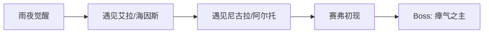
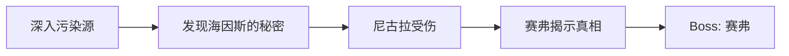
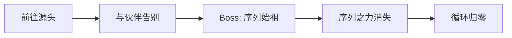

# Salu 游戏设计方案（v0.1）

类型: plans
状态: 进行中

## 🎯 游戏定位

| 维度 | 决定 |
| --- | --- |
| **类型** | 卡牌 Roguelike + 碎片叙事 |
| **风格** | 克苏鲁 / 神秘学（未知、疯狂、禁忌知识） |
| **结构** | 有明确结局的冒险游戏（通关即结束） |
| **叙事方式** | 碎片叙事（事件文本、NPC 对话、卡牌描述拼凑世界观） |
| **第一版规模** | 1 条主线 + 5-10 场战斗 + 3-5 个 NPC |

---

## 🔧 最小可行方案

基于现有战斗体系，改动最小的方式：

| 现有系统 | 改造方向 |
| --- | --- |
| 事件房间 | 变成剧情事件，NPC 对话、世界观碎片 |
| 休息点 | 变成据点，可以和固定 NPC 聊天 |
| Boss 战后 | 加入结局剧情 |
| 卡牌/敌人/遗物 | 重新命名，换成克苏鲁风格 |

**不需要改的：** 战斗流程、地图生成、卡牌机制

---

## 📝 待完成：游戏简介

在写任何代码之前，先回答这三个问题：

- [x]  **玩家是谁？** 安德——被选中的终结者，在雨夜被神秘人赋予使命
- [x]  **为什么冒险？** 完成「终结」的使命，虽然他自己也不完全理解
- [x]  **最终要达成什么？** 让序列之力从世界消失，成为新循环的起点

<aside>
📜

**游戏简介 v1**

安德在一个雨夜醒来，身边站着一个面目模糊的人。

那人说了一些话——关于「序列」、关于「终结」、关于某种必须被完成的使命。话说完，那人便消失了，只留下安德手心里一张灼热的卡牌。

安德不明白自己为什么被选中。但当第一只怪物从黑暗中扑来时，他发现自己已经学会了战斗。

在旅途中，他遇到了愿意与他同行的人。他们给他药剂、情报、片刻的温暖。但安德隐约知道：自己走的是一条无法回头的路。

当最后的敌人倒下时，序列之力从世界褪去。伙伴们失去了能力，安德完成了他的使命——成为终结者，也成为新开始的起点。

而那棵古老的树洞深处，某种东西正在沉睡，等待下一次循环。

</aside>

---

## 👥 核心 NPC

| 名字 | 定位 | 简介 | 参考 |
| --- | --- | --- | --- |
| **艾拉（Aira）** | 青梅竹马 | 安德童年的伙伴，温柔而坚定。在据点等待安德归来，提供情感支撑和回忆碎片 | 奥黛丽，诡秘之主 |
| **海因斯（Hines）** | 引路人/队长 | 神秘组织的指挥官，冷静而有谋略。招募安德执行使命，提供任务和情报 | 格拉夫上校，安德的游戏 |
| **赛弗（Cipher）** | 反派 | 身份成谜的敌人，似乎知道一些安德不知道的真相。目的不明 | 来源不明 |
| **尼古拉（Nikola）** | 好友/战友 | 在旅途中结识的同伴，乐观开朗。与安德并肩作战，提供战斗支持 | 尼古拉，安德的游戏，安德的好朋友 |
| **阿尔托（Alto）** | 安德的影子 | 沉默寡言的少年，总是跟在安德身后。有着超乎常人的观察力和潜力 | 小豆子，安德的影子。 |

---

## 📜 整体故事线（3 章）

### 第一章：觉醒

| 节点 | 剧情 |
| --- | --- |
| 雨夜觉醒 | 🎭 安德失忆醒来，神秘人赋予使命 |
| 遇见艾拉/海因斯 | 👥 重逢青梅竹马艾拉，认识指挥官海因斯 |
| 遇见尼古拉/阿尔托 | 🤝 尼古拉加入，阿尔托沉默跟随 |
| 赛弗初现 | ⚠️ 赛弗留下警告：上一个终结者已死 |
| Boss: 瘴气之主 | 🎯 净化第一个污染源 |

### 第二章：真相

| 节点 | 剧情 |
| --- | --- |
| 深入污染源 | 🔍 污染源背后有更大的阴谋 |
| 发现海因斯的秘密 | 💢 海因斯知道真相却隐瞒了安德 |
| 尼古拉受伤 | 💔 尼古拉为保护安德身受重伤 |
| 赛弗揭示真相 | 🗣️ 赛弗揭露：终结者是循环的一部分 |
| Boss: 赛弗 | ⚔️ 击败赛弗，但真相让安德动摇 |

### 最终章：终结

| 节点 | 剧情 |
| --- | --- |
| 前往源头 | 🚶 安德决定独自前往源头 |
| 与伙伴告别 | 👋 艾拉、阿尔托送别，知道这是永别 |
| Boss: 序列始祖 | 👹 序列始祖：循环的根源，最终之敌 |
| 序列之力消失 | ✨ 安德完成使命，序列之力从世界消失 |
| 循环归零 | 🌳 始祖回到树洞沉睡，等待下一次循环 |

---

## 克苏鲁风格重命名方案

### 卡牌（11张）

| 原名 | 克苏鲁风格新名 | 风味说明 |
| --- | --- | --- |
| 打击 | **凝视之触** | 以目光为刃 |
| 防御 | **灰雾护盾** | 召唤迷雾庇护 |
| 重击 | **深渊重锤** | 自深渊汲取力量 |
| 柄击 | **触须鞭笞** | 灵活而致命 |
| 耸肩 | **躯壳硬化** | 身体短暂石化 |
| 燃烧 | **禁忌献祭** | 以理智换取力量 |
| 晾衣绳 | **窒息缠绕** | 来自虚空的束缚 |
| 横扫 | **裂隙横断** | 撕裂空间的一击 |
| 威吓 | **疯狂低语** | 令敌人精神崩溃 |
| 敏捷姿态 | **虚空步** | 踏入另一维度 |
| 淬毒打击 | **腐蚀之触** | 沾染远古毒素 |

---

### 敌人

### Act 1

| 类型 | 原名 | 克苏鲁风格新名 |
| --- | --- | --- |
| 普通 | 下颚虫 | **咀嚼者** |
| 普通 | 信徒 | **虔信者** |
| 普通 | 绿虱子 | **翠鳞虫** |
| 普通 | 红虱子 | **血眼虫** |
| 普通 | 孢子兽 | **腐菌体** |
| 普通 | 酸液幼体 | **溶蚀幼崽** |
| 精英 | 酸液史莱姆 | **深渊黏体** |
| 精英 | 岩石守卫 | **沉默守墓人** |
| Boss | 毒雾巨像 | **瘴气之主** |

### Act 2

| 类型 | 原名 | 克苏鲁风格新名 |
| --- | --- | --- |
| 普通 | 幽影刺客 | **虚影猎手** |
| 普通 | 机械哨兵 | **铭文傀儡** |
| 精英 | 符文守卫 | **符文执行者** |
| Boss | 时空观测者 | **窥视者** |

---

### 遗物（7个）

| 原名 | 克苏鲁风格新名 | 风味说明 |
| --- | --- | --- |
| 燃烧之血 | **永燃心脏** | 不死者的馈赠 |
| 金刚杵 | **远古骨锤** | 古神遗骸制成 |
| 灯笼 | **幽冥灯火** | 照亮彼岸之路 |
| 铁护臂 | **鳞甲残片** | 沉睡巨兽的鳞片 |
| 羽披风 | **夜鸦羽翼** | 来自无名之鸟 |
| 战旗 | **血誓旗帜** | 浸染无数亡魂 |
| 巨像核心 | **始祖碎片** | 序列始祖的一部分 |

---

## 💡 设计参考

- **Hades**：剧情在 run 之间逐渐展开，NPC 关系发展
- **杀戮尖塔**：核心战斗循环、卡牌成长
- **诡秘之主**：克苏鲁 + 序列体系的风格参考（但不直接使用 IP）
- **空洞骑士 / 黑魂**：碎片叙事的典范