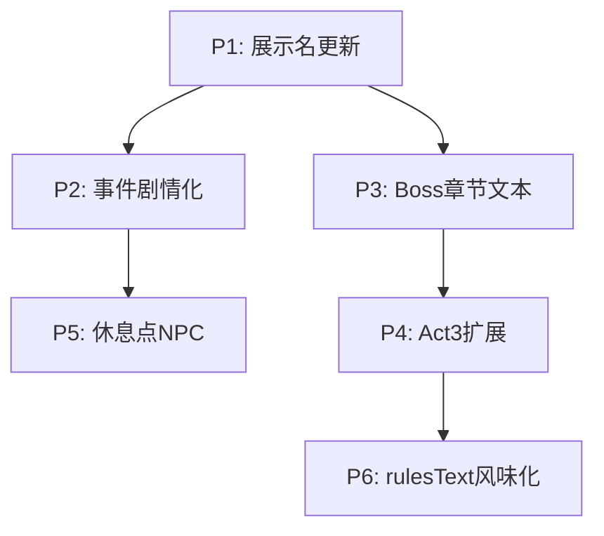

# Plan A（v0.1）：让代码向设定靠拢 - 2026-01-10

## 0. 背景与目标

**设定文档**：`.cursor/rules/Salu游戏设定与剧情（v0.1）.mdc`

**核心目标**：
1. 让所有用户可见的文本（卡牌名/敌人名/遗物名/事件文本）统一为 v0.1 克苏鲁风格
2. 补充叙事内容（事件剧情化、休息点 NPC 对话、Boss 战后章节文本）
3. 扩展到 3 Act 完整主线
4. 保持战斗流程、地图生成、卡牌机制不变

**验收标准**：每个 P 完成后必须通过 `swift test` + CLI 冒烟测试。

---

## P1：展示名全面更新（代码向设定靠拢 - 第一步）

### P1.1 目标

让所有用户可见的名称统一为 v0.1 克苏鲁风格。

### P1.2 改动范围

#### 卡牌（11 张 + 升级版）

| 文件 | 改动 |
|------|------|
| `Sources/GameCore/Cards/Definitions/Ironclad/Attacks.swift` | `Strike.name` → "凝视之触"，`StrikePlus.name` → "凝视之触+"，`Bash.name` → "深渊重锤"，`BashPlus.name` → "深渊重锤+"，`PommelStrike.name` → "触须鞭笞"，`Clothesline.name` → "窒息缠绕"，`Cleave.name` → "裂隙横断"，`PoisonedStrike.name` → "腐蚀之触" |
| `Sources/GameCore/Cards/Definitions/Ironclad/Skills.swift` | `Defend.name` → "灰雾护盾"，`DefendPlus.name` → "灰雾护盾+"，`ShrugItOff.name` → "躯壳硬化"，`Intimidate.name` → "疯狂低语"，`AgileStance.name` → "虚空步" |
| `Sources/GameCore/Cards/Definitions/Ironclad/Powers.swift` | `Inflame.name` → "禁忌献祭" |

#### 敌人（Act 1: 9 个，Act 2: 4 个）

| 文件 | 改动 |
|------|------|
| `Sources/GameCore/Enemies/Definitions/Act1/Act1NormalEnemies.swift` | `JawWorm.name` → "咀嚼者"，`Cultist.name` → "虔信者"，`LouseGreen.name` → "翠鳞虫"，`LouseRed.name` → "血眼虫"，`SporeBeast.name` → "腐菌体"，`SlimeSmallAcid.name` → "溶蚀幼崽" |
| `Sources/GameCore/Enemies/Definitions/Act1/Act1EliteEnemies.swift` | `SlimeMediumAcid.name` → "深渊黏体"，`StoneSentinel.name` → "沉默守墓人" |
| `Sources/GameCore/Enemies/Definitions/Act1/Act1BossEnemies.swift` | `ToxicColossus.name` → "瘴气之主" |
| `Sources/GameCore/Enemies/Definitions/Act2/Act2NormalEnemies.swift` | `ShadowStalker.name` → "虚影猎手"，`ClockworkSentinel.name` → "铭文傀儡" |
| `Sources/GameCore/Enemies/Definitions/Act2/Act2EliteEnemies.swift` | `RuneGuardian.name` → "符文执行者" |
| `Sources/GameCore/Enemies/Definitions/Act2/Act2BossEnemies.swift` | `ChronoWatcher.name` → "窥视者" |

#### 遗物（7 个）

| 文件 | 改动 |
|------|------|
| `Sources/GameCore/Relics/Definitions/StarterRelics.swift` | `BurningBloodRelic.name` → "永燃心脏"，`description` → "不死者的馈赠。战斗胜利后恢复 6 点生命值" |
| `Sources/GameCore/Relics/Definitions/CommonRelics.swift` | `VajraRelic.name` → "远古骨锤"，`LanternRelic.name` → "幽冥灯火"，`IronBracerRelic.name` → "鳞甲残片" |
| `Sources/GameCore/Relics/Definitions/UncommonRelics.swift` | `FeatherCloakRelic.name` → "夜鸦羽翼" |
| `Sources/GameCore/Relics/Definitions/RareRelics.swift` | `WarBannerRelic.name` → "血誓旗帜" |
| `Sources/GameCore/Relics/Definitions/BossRelics.swift` | `ColossusCoreRelic.name` → "始祖碎片" |

### P1.3 验收

```bash
swift build
swift test
SALU_TEST_MODE=1 SALU_TEST_MAP=mini swift run GameCLI --seed 1
# 确认战斗界面显示新名称（凝视之触、咀嚼者、永燃心脏等）
```

---

## P2：事件剧情化（NPC 对话 + 世界观碎片）

### P2.1 目标

将现有 3 个基础事件改造为符合 v0.1 设定的剧情事件。

### P2.2 改动范围

#### 现有事件重写

| 事件 | 改造方向 |
|------|----------|
| 拾荒者 → **「流浪者的低语」** | NPC：遇到一个流浪者，可能是前任终结者的幽灵。选项涉及获取情报或金币。 |
| 祭坛 → **「序列祭坛」** | 世界观：发现一座刻有序列符文的祭坛。选项涉及献祭金币换遗物或祈祷回血。 |
| 训练 → **「尼古拉的指导」** | NPC：尼古拉出现，提供战斗技巧。选项涉及升级卡牌或学习新招。 |

#### 新增事件（可选，P2 或后续）

| 事件 | 描述 |
|------|------|
| **「赛弗的警告」** | 赛弗突然现身，留下关于终结者命运的警告。（第一章中期触发） |
| **「艾拉的回忆」** | 在休息点遇到艾拉的幻影，获取童年回忆碎片。 |

### P2.3 文件改动

| 文件 | 改动 |
|------|------|
| `Sources/GameCore/Events/Definitions/BasicEvents.swift` | 重写 `ScavengerEvent`、`AltarEvent`、`TrainingEvent` 的 `name`、`description`、选项文本 |
| `Sources/GameCore/Kernel/IDs.swift` | 新增 `EventID`（如果需要新事件） |
| `Sources/GameCore/Events/EventRegistry.swift` | 注册新事件（如果需要） |

### P2.4 验收

```bash
swift build
swift test
SALU_TEST_MODE=1 SALU_TEST_MAP=event swift run GameCLI --seed 1
# 确认事件界面显示新剧情文本
```

---

## P3：Boss 战后章节文本

### P3.1 目标

在 Boss 战胜利后显示章节收束文本，增强叙事感。

### P3.2 改动范围

#### GameCore 新增

| 文件 | 改动 |
|------|------|
| `Sources/GameCore/Run/ChapterText.swift`（新建） | 定义各章节的收束文本和结局文本 |

```swift
public enum ChapterText {
    /// 第一章收束文本（击败瘴气之主后）
    public static let chapter1Ending: String = """
    瘴气散去，阳光透过裂缝照入神殿。
    ...
    """
    
    /// 第二章收束文本（击败窥视者后）
    public static let chapter2Ending: String = """
    窥视者的身躯化为无数光点消散...
    """
    
    /// 最终章结局文本
    public static let finalEnding: String = """
    序列之力消散的那一天，世界变得安静了。
    ...
    """
}
```

#### GameCLI 改动

| 文件 | 改动 |
|------|------|
| `Sources/GameCLI/Rooms/Handlers/BossRoomHandler.swift` | 在 Boss 胜利后显示对应章节文本 |
| `Sources/GameCLI/Screens/ResultScreen.swift`（或新建） | 显示章节收束/结局界面 |

### P3.3 验收

```bash
swift build
swift test
SALU_TEST_MODE=1 SALU_TEST_MAP=mini swift run GameCLI --seed 1
# 击败 Boss 后确认显示章节收束文本
```

---

## P4：Act 3 扩展（完整主线）

### P4.1 目标

从 2 Act 扩展到 3 Act，实现完整的"觉醒 → 真相 → 终结"主线。

### P4.2 改动范围

#### GameCore 改动

| 文件 | 改动 |
|------|------|
| `Sources/GameCore/Run/RunState.swift` | `maxFloor` 默认值从 `2` 改为 `3` |
| `Sources/GameCore/Enemies/Definitions/Act3/`（新建目录） | 新增 Act 3 敌人定义 |
| `Sources/GameCore/Enemies/Act3EnemyPool.swift`（新建） | Act 3 敌人池 |
| `Sources/GameCore/Enemies/Act3EncounterPool.swift`（新建） | Act 3 遭遇池 |
| `Sources/GameCore/Enemies/EnemyRegistry.swift` | 注册 Act 3 敌人 |

#### Act 3 敌人设计（初版）

| 类型 | 名称（v0.1） | 描述 |
|------|-------------|------|
| 普通 | **虚无行者** | 来自虚无之心的生物 |
| 普通 | **梦境寄生者** | 寄生在梦境中的怪物 |
| 精英 | **循环守卫** | 守护序列始祖的存在 |
| Boss | **序列始祖** | 最终 Boss，循环的根源 |

#### GameCLI 改动

| 文件 | 改动 |
|------|------|
| `Sources/GameCLI/Rooms/Handlers/BossRoomHandler.swift` | 支持 Act 3 Boss（序列始祖） |

### P4.3 验收

```bash
swift build
swift test
SALU_TEST_MODE=1 SALU_TEST_MAX_FLOOR=3 swift run GameCLI --seed 1
# 确认能够完整通关 3 Act
```

---

## P5：休息点 NPC 对话（据点化）

### P5.1 目标

将休息点改造为「据点」，可与固定 NPC（艾拉）对话，获取剧情碎片。

### P5.2 改动范围

| 文件 | 改动 |
|------|------|
| `Sources/GameCore/Events/Definitions/RestPointDialogues.swift`（新建） | 休息点对话内容 |
| `Sources/GameCLI/Rooms/Handlers/RestRoomHandler.swift` | 新增"与艾拉对话"选项 |
| `Sources/GameCLI/Screens/DialogueScreen.swift`（新建） | NPC 对话界面 |

### P5.3 验收

```bash
swift build
swift test
SALU_TEST_MODE=1 SALU_TEST_MAP=rest swift run GameCLI --seed 1
# 确认休息点显示 NPC 对话选项
```

---

## P6：rulesText 风味化 + 卡牌描述

### P6.1 目标

为所有卡牌添加克苏鲁风格的 `rulesText` 风味描述。

### P6.2 示例改动

```swift
// Before
public static let rulesText = "造成 6 点伤害"

// After
public static let rulesText = "凝视深渊，深渊亦凝视着你。造成 6 点伤害。"
```

### P6.3 验收

```bash
swift build
swift test
# 确认卡牌描述显示风味文本
```

---

## 执行顺序与依赖



- **P1 是基础**：必须先完成展示名更新，后续的叙事内容才有统一的命名基础
- **P2/P3 可并行**：事件剧情化和 Boss 章节文本相互独立
- **P4 依赖 P3**：Act 3 需要先有章节文本的框架
- **P5 依赖 P2**：休息点 NPC 对话复用事件系统的对话框架
- **P6 最后**：风味化是锦上添花，等核心内容稳定后再做

---

## 风险与注意事项

1. **ID 不变**：所有 `CardID`、`EnemyID`、`RelicID` 保持不变，只改 `name`/`description` 等展示属性
2. **测试兼容**：现有测试可能硬编码了旧名称，需要同步更新
3. **存档兼容**：由于只改展示名不改 ID，存档应保持兼容
4. **CLI 冒烟**：每个 P 完成后必须用 CLI 实际运行确认效果

---

## 附录：快速验收命令

```bash
# 编译
swift build

# 全量测试
swift test

# CLI 冒烟（最小地图）
SALU_TEST_MODE=1 SALU_TEST_MAP=mini swift run GameCLI --seed 1

# CLI 冒烟（事件测试）
SALU_TEST_MODE=1 SALU_TEST_MAP=event swift run GameCLI --seed 1

# CLI 冒烟（休息点测试）
SALU_TEST_MODE=1 SALU_TEST_MAP=rest swift run GameCLI --seed 1

# CLI 冒烟（多 Act 测试）
SALU_TEST_MODE=1 SALU_TEST_MAX_FLOOR=3 swift run GameCLI --seed 1
```

