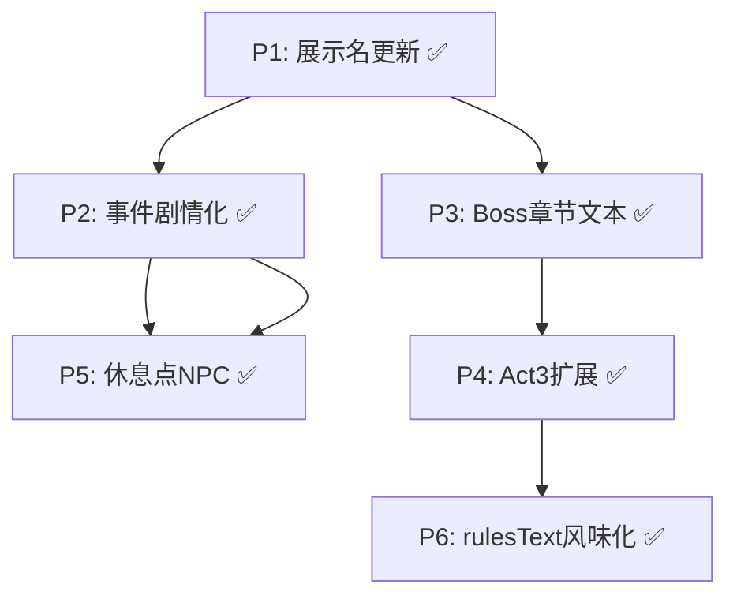

# Plan A（v0.1）：让代码向设定靠拢 - 2026-01-10

## 0. 背景与目标

**设定文档**：`.cursor/rules/Salu游戏设定与剧情（v0.1）.mdc`

**核心目标**：
1. 让所有用户可见的文本（卡牌名/敌人名/遗物名/事件文本）统一为 v0.1 克苏鲁风格
2. 补充叙事内容（事件剧情化、休息点 NPC 对话、Boss 战后章节文本）
3. 扩展到 3 Act 完整主线
4. 保持战斗流程、地图生成、卡牌机制不变

**验收标准**：每个 P 完成后必须通过 `swift test` + CLI 冒烟测试。

---

## P1：展示名全面更新（代码向设定靠拢 - 第一步）✅ 已完成

### P1.1 目标

让所有用户可见的名称统一为 v0.1 克苏鲁风格。

### P1.2 实际改动

#### 卡牌（14 张含升级版）✅
- `Strike` → "凝视之触"（以目光为刃）
- `StrikePlus` → "凝视之触+"（凝视深渊，深渊亦凝视着你）
- `Defend` → "灰雾护盾"（召唤迷雾庇护）
- `DefendPlus` → "灰雾护盾+"（迷雾凝聚成形）
- `Bash` → "深渊重锤"（自深渊汲取力量）
- `BashPlus` → "深渊重锤+"（深渊的力量在你体内觉醒）
- `PommelStrike` → "触须鞭笞"（灵活而致命）
- `Clothesline` → "窒息缠绕"（来自虚空的束缚）
- `Cleave` → "裂隙横断"（撕裂空间的一击）
- `PoisonedStrike` → "腐蚀之触"（沾染远古毒素）
- `ShrugItOff` → "躯壳硬化"（身体短暂石化）
- `Intimidate` → "疯狂低语"（令敌人精神崩溃）
- `Inflame` → "禁忌献祭"（以理智换取力量）
- `AgileStance` → "虚空步"（踏入另一维度）

#### 敌人（13 个）✅
- **Act1 普通**：咀嚼者、虔信者、翠鳞虫、血眼虫、腐菌体、溶蚀幼崽
- **Act1 精英**：深渊黏体、沉默守墓人
- **Act1 Boss**：瘴气之主
- **Act2 普通**：虚影猎手、铭文傀儡
- **Act2 精英**：符文执行者
- **Act2 Boss**：窥视者

#### 遗物（7 个）✅
- 燃烧之血 → "永燃心脏"（不死者的馈赠）
- 金刚杵 → "远古骨锤"（古神遗骸制成）
- 灯笼 → "幽冥灯火"（照亮彼岸之路）
- 铁护臂 → "鳞甲残片"（沉睡巨兽的鳞片）
- 羽披风 → "夜鸦羽翼"（来自无名之鸟）
- 战旗 → "血誓旗帜"（浸染无数亡魂）
- 巨像核心 → "始祖碎片"（序列始祖的一部分）

#### 其他改动 ✅
- 玩家名："铁甲战士" → "安德"
- 游戏标题："杀戮尖塔 CLI" → "Salu the Fire"
- 战斗界面标题更新

### P1.3 验收 ✅

```bash
swift test  # 118 tests passed
SALU_TEST_MODE=1 SALU_TEST_MAP=mini swift run GameCLI --seed 1
```

---

## P2：事件剧情化（NPC 对话 + 世界观碎片）✅ 已完成

### P2.1 目标

将现有 3 个基础事件改造为符合 v0.1 设定的剧情事件。

### P2.2 实际改动

#### 事件重写 ✅

| 旧名 | 新名 | 描述 |
|------|------|------|
| 拾荒者 | **流浪者的低语** 👻 | 遇到前任终结者的幽灵，可获取情报或金币 |
| 祭坛 | **序列祭坛** 🗿 | 刻有序列符文的祭坛，"以血肉为锁，以灵魂为钥" |
| 训练 | **尼古拉的指导** 🤝 | NPC 尼古拉出现，提供战斗技巧指导 |

#### 文件改动
- `Sources/GameCore/Events/Definitions/BasicEvents.swift`：完全重写 3 个事件

### P2.3 验收 ✅

```bash
swift test  # 118 tests passed
SALU_TEST_MODE=1 SALU_TEST_MAP=event swift run GameCLI --seed 1
```

---

## P3：Boss 战后章节文本 + 起点剧情 ✅ 已完成

### P3.1 目标

在 Boss 战胜利后显示章节收束文本，在起点显示开场剧情。

### P3.2 实际改动

#### GameCore 新增 ✅
- `Sources/GameCore/Run/ChapterText.swift`：定义各章节收束文本和结局文本

#### GameCLI 新增/改动 ✅
- `Sources/GameCLI/Screens/ChapterEndScreen.swift`（新建）：章节结束界面
- `Sources/GameCLI/Screens/PrologueScreen.swift`（新建）：序章界面，各章节开场剧情
- `Sources/GameCLI/Rooms/Handlers/BossRoomHandler.swift`：Boss 胜利后显示章节文本
- `Sources/GameCLI/Rooms/Handlers/StartRoomHandler.swift`：起点显示开场剧情（测试模式跳过）

#### 剧情内容 ✅
- **第一章开场**：雨夜觉醒，神秘人赋予卡牌
- **第二章开场**：前往时钟塔，追寻真相
- **第三章开场**：独自前往虚无之心，与艾拉告别
- **第一章收束**：击败瘴气之主，海因斯的指令
- **第二章收束**：击败窥视者，安德的决心
- **最终结局**：序列之力消散，各角色的归宿

### P3.3 验收 ✅

```bash
swift test  # 118 tests passed
SALU_TEST_MODE=1 SALU_TEST_MAP=mini swift run GameCLI --seed 1
# 可看到开场剧情和章节收束文本

# 多 Act 测试
SALU_TEST_MODE=1 SALU_TEST_MAP=mini SALU_TEST_MAX_FLOOR=2 swift run GameCLI --seed 1
```

---

## P4：Act 3 扩展（完整主线）✅ 已完成

### P4.1 目标

从 2 Act 扩展到 3 Act，实现完整的"觉醒 → 真相 → 终结"主线。

### P4.2 实际改动

#### GameCore 改动 ✅

| 文件 | 改动 |
|------|------|
| `Sources/GameCore/Run/RunState.swift` | `maxFloor` 默认值从 `2` 改为 `3` |
| `Sources/GameCore/Enemies/Definitions/Act3/Act3NormalEnemies.swift`（新建） | 虚无行者、梦境寄生者 |
| `Sources/GameCore/Enemies/Definitions/Act3/Act3EliteEnemies.swift`（新建） | 循环守卫 |
| `Sources/GameCore/Enemies/Definitions/Act3/Act3BossEnemies.swift`（新建） | 序列始祖（最终 Boss） |
| `Sources/GameCore/Enemies/Act3EnemyPool.swift`（新建） | Act 3 敌人池 |
| `Sources/GameCore/Enemies/Act3EncounterPool.swift`（新建） | Act 3 遭遇池（5 种遭遇） |
| `Sources/GameCore/Enemies/EnemyRegistry.swift` | 注册 4 个 Act 3 敌人 |

#### GameCLI 改动 ✅

| 文件 | 改动 |
|------|------|
| `Sources/GameCLI/Rooms/Handlers/BattleRoomHandler.swift` | 支持 Act 3 敌人池/遭遇池 |
| `Sources/GameCLI/Rooms/Handlers/EliteRoomHandler.swift` | 支持 Act 3 精英敌人池 |
| `Sources/GameCLI/Rooms/Handlers/BossRoomHandler.swift` | 支持 Act 3 Boss（序列始祖） |

#### Act 3 敌人设计 ✅

| 类型 | 名称（v0.1） | HP | 特点 |
|------|-------------|-----|------|
| 普通 | **虚无行者** | 42~48 | 攻击附带易伤，有格挡 |
| 普通 | **梦境寄生者** | 28~34 | 多状态效果（虚弱/脆弱/中毒），可回复 |
| 精英 | **循环守卫** | 85~95 | 3 回合循环，力量成长 |
| Boss | **序列始祖** | 150~170 | 4 回合循环，多段攻击，自愈，最终 Boss |

#### 遭遇池 ✅

- 单敌人：虚无行者 / 梦境寄生者
- 多敌人：虚无行者 + 梦境寄生者 / 梦境寄生者 × 2 / 虚无行者 × 2

### P4.3 验收 ✅

```bash
swift build  # ✅ 编译成功
swift test   # ✅ 118 tests passed
SALU_TEST_MODE=1 SALU_TEST_MAP=mini SALU_TEST_MAX_FLOOR=3 swift run GameCLI --seed 1
# 确认能够完整通关 3 Act，最终 Boss 为序列始祖
```

---

## P5：休息点 NPC 对话（据点化）✅ 已完成

### P5.1 目标

将休息点改造为「灰烬营地」，可与固定 NPC（艾拉）对话，获取剧情碎片。

### P5.2 实际改动

#### GameCore 新增 ✅

| 文件 | 内容 |
|------|------|
| `Sources/GameCore/Events/Definitions/RestPointDialogues.swift`（新建） | 艾拉对话内容（按章节区分） |

#### GameCLI 改动 ✅

| 文件 | 改动 |
|------|------|
| `Sources/GameCLI/Screens/MapScreen.swift` | 休息点标题改为"灰烬营地"，新增"与艾拉对话"选项 |
| `Sources/GameCLI/Screens.swift` | 添加 `showAiraDialogue` 入口 |
| `Sources/GameCLI/Rooms/Handlers/RestRoomHandler.swift` | 处理选项 3（对话） |

#### 对话内容 ✅

| 章节 | 对话主题 |
|------|----------|
| Act 1 | 童年回忆、艾拉的担忧与等待 |
| Act 2 | 真相揭示后的安慰、"答应我活下去" |
| Act 3 | 告别场景、怀表定情信物、最后的吻 |

### P5.3 验收 ✅

```bash
swift build  # ✅ 编译成功
swift test   # ✅ 118 tests passed
SALU_TEST_MODE=1 SALU_TEST_MAP=rest swift run GameCLI --seed 1
# 休息点显示"灰烬营地"，可选择 [1] 休息 [2] 升级 [3] 与艾拉对话
```

---

## P6：rulesText 风味化 + 卡牌描述 ✅ 已完成（P1 中一并实现）

### P6.1 目标

为所有卡牌添加克苏鲁风格的 `rulesText` 风味描述。

### P6.2 实际情况

**已在 P1 中完成！** 所有卡牌的 `rulesText` 都使用 `"风味描述。机制效果。"` 格式：

| 卡牌 | rulesText |
|------|-----------|
| 凝视之触 | "以目光为刃。造成 6 点伤害。" |
| 凝视之触+ | "凝视深渊，深渊亦凝视着你。造成 9 点伤害。" |
| 灰雾护盾 | "召唤迷雾庇护。获得 5 点格挡。" |
| 深渊重锤 | "自深渊汲取力量。造成 8 点伤害，给予 2 层易伤。" |
| 触须鞭笞 | "灵活而致命。造成 9 点伤害，抽 1 张牌。" |
| 躯壳硬化 | "身体短暂石化。获得 8 点格挡，抽 1 张牌。" |
| 禁忌献祭 | "以理智换取力量。获得 2 点力量。" |
| 窒息缠绕 | "来自虚空的束缚。造成 12 点伤害，给予 2 层虚弱。" |
| 裂隙横断 | "撕裂空间的一击。对所有敌人造成 4 点伤害。" |
| 疯狂低语 | "令敌人精神崩溃。使所有敌人获得 2 层虚弱。" |
| 虚空步 | "踏入另一维度。获得 1 点敏捷。" |
| 腐蚀之触 | "沾染远古毒素。造成 5 点伤害，给予 2 层中毒。" |

### P6.3 验收 ✅

```bash
swift test  # ✅ 通过
# 卡牌描述已包含风味文本
```

---

## 执行顺序与依赖



- **P1 是基础**：✅ 已完成展示名更新
- **P2/P3 可并行**：✅ 已完成事件剧情化和 Boss 章节文本
- **P4 依赖 P3**：✅ 已完成 Act 3 扩展
- **P5 依赖 P2**：✅ 已完成休息点据点化
- **P6 最后**：✅ 已完成（在 P1 中一并实现）

---

## 当前进度总结

| 优先级 | 内容 | 状态 | 完成时间 |
|--------|------|------|----------|
| P1 | 展示名更新（卡牌/敌人/遗物）+ 玩家名改为安德 | ✅ 完成 | 2026-01-10 |
| P2 | 事件剧情化（NPC 对话 + 世界观碎片）| ✅ 完成 | 2026-01-10 |
| P3 | Boss 战后章节文本 + 起点剧情 | ✅ 完成 | 2026-01-10 |
| P4 | Act 3 扩展（虚无行者/梦境寄生者/循环守卫/序列始祖）| ✅ 完成 | 2026-01-10 |
| P5 | 休息点 NPC 对话（灰烬营地 + 艾拉对话）| ✅ 完成 | 2026-01-10 |
| P6 | rulesText 风味化（P1 中一并完成）| ✅ 完成 | 2026-01-10 |

---

## 附录：快速验收命令

```bash
# === 基础命令 ===
swift build                    # 编译
swift test                     # 全量测试
swift run GameCLI --seed 1     # 完整游戏体验（含剧情等待）

# === 测试模式（跳过剧情等待）===
# 最小地图：起点 → 精英 → Act1 Boss
SALU_TEST_MODE=1 SALU_TEST_MAP=mini swift run GameCLI --seed 1

# 普通战斗测试
SALU_TEST_MODE=1 SALU_TEST_MAP=battle swift run GameCLI --seed 1

# 事件测试
SALU_TEST_MODE=1 SALU_TEST_MAP=event swift run GameCLI --seed 1

# 休息点测试
SALU_TEST_MODE=1 SALU_TEST_MAP=rest swift run GameCLI --seed 1

# 商店测试
SALU_TEST_MODE=1 SALU_TEST_MAP=shop swift run GameCLI --seed 1

# === 多 Act 测试 ===
# Act1 → Act2
SALU_TEST_MODE=1 SALU_TEST_MAP=mini SALU_TEST_MAX_FLOOR=2 swift run GameCLI --seed 1

# 完整三章
SALU_TEST_MODE=1 SALU_TEST_MAP=mini SALU_TEST_MAX_FLOOR=3 swift run GameCLI --seed 1

# === 特殊场景 ===
# 双敌人战斗
SALU_TEST_MODE=1 SALU_TEST_MAP=battle SALU_FORCE_MULTI_ENEMY=1 swift run GameCLI --seed 1

# 自定义数据目录
SALU_DATA_DIR=/tmp/salu swift run GameCLI --seed 1
```
